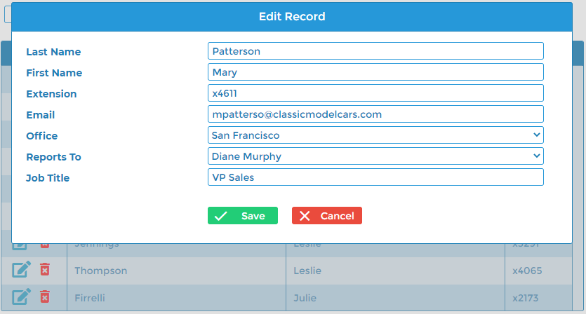
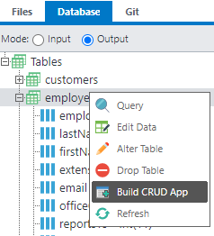
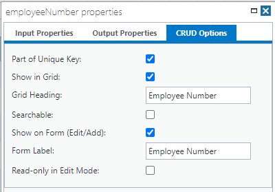
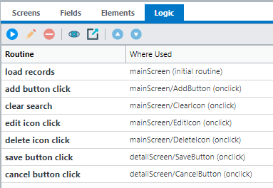
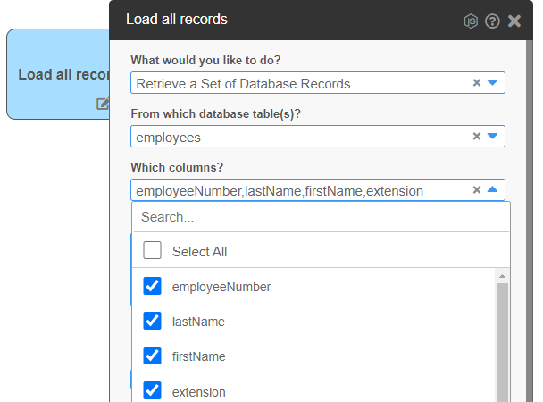

CRUD with Edit Screen Template
==============================
This template provides an example of a full CRUD (Create/Read/Update/Delete) application with search capabilities.

Generating Custom CRUD Applications
-----------------------------------
You can create a starting point for a CRUD application instantly by right-clicking the appropriate table in the Database tab, and selecting the option **Build CRUD App**.

You can double-click each individual column within a table to specify properties that will be used when generating a CRUD application.

Routines
--------
The CRUD generator does not create code. It creates No-code Routines that appear in the Logic tab of the Visual Designer interface.

Each routine can contain one or more configurable steps.

